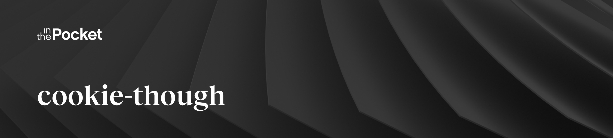

### 🍪 Easy to use, minimal footprint application that manages cookie preferences

So delicious, you'll never need another library again 😄  
View the documentation on how to [install](https://cookiethough.dev/installation/) and [configure](https://cookiethough.dev/configuration/) the banner.

## Features

* simplicity: easily usable from a developer perspective
* accessibility: needs to be accessible
* adaptability: can be easily tweaked or adjusted to the needs of a project
* standards compliance: GDPR compliant, fine grained cookie control
* low footprint: size of the widget should be minimal

## Contributing

If you're interesting in contributing to Cookie Though, please read our [contribution guidelines](https://github.com/inthepocket/cookie-though/blob/master/CONTRIBUTING.md) **before submitting a pull request**.
